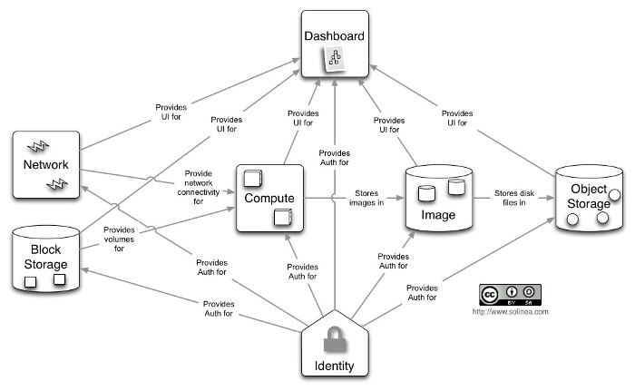

# Openstack / python-nova 

Xilopix fonctionne avec Openstack, nous avons donc du apprendre rapidement son fonctionnement pour pouvoir ensuite travailler plainement sur sa mise en place avec Terraform.

### Introduction

Openstack est un projet qui est né en 2010 (licence Apache 2.0) par l'entreprise RackSpace. OpenStack est un logiciel libre qui va nous permettre de faire du cloud computing et qui permet de faire du IaaS pour du cloud privé ou public. Le but d'Openstack est d'offrir à son utilisateur une multitude de module qui va lui permettre de faire de l'infrastructure as a service c'est à dire deployer des machines virtuelles en optimisant les ressources materielles. On peut les deployer dynamiquement pour une courte durée, mais il est également possible de deployer un ensemble de machines constituant une infrastructure externe.

### Les modules : services d'OpenStack.

Openstack se compose de plusieurs modules pour fonctionner, avec des modules plus ou moins important pour la création d'infrastructure.

##### Keystone, le service d'identité

Fournit un service d’authentification et d’autorisation pour les autres services d’OpenStack. Fournit un catalogue de endpoints pour tous les services d’OpenStack.

##### Glance, la gestion d'images

Stocke et récupère des images disques de machines virtuelles. OpenStack Compute les utilise lors du provisioning d’instance.

##### Nova, le Compute

Nova est le coeur du project Openstack, il gère le cycle de vie des instances dans un environnement OpenStack. Les tâches incluent la planification, la création et la mise hors service de machines virtuelles à la demande.

##### Horizon, l'interface web

Fournit un portail libre-service de type web permettant d’interagir avec les services sous-jacents d’OpenStack, comme le lancement d’une instance, l’attribution d’adresses IP ou la configuration des contrôles d’accès.

##### Cinder, le service de disques persistants

Fournit un stockage bloc persistant aux instances en cours d’exécution. Son architecture basée sur des drivers de type plugin facilite la création et la gestion des devices de stockage bloc.

##### Neutron, la gestion de réseaux

Permet le Network-Connectivity-as-a-Service pour d’autres services d’OpenStack, comme Compute. Il fournit une API utilisateur pour définir les réseaux et les attachements à ces réseaux. Il possède une architecture modulaire qui permet le support de la plupart des fournisseurs et des technologies réseau.

##### Swift, le stockage d'objet

Stocke et récupère des objets de données non structurées via une API RESTful basée sur HTTP. Le service est hautement tolérant aux pannes avec sa réplication de données et son architecture de type scale-out. Son implémentation diffère des serveurs de fichiers à répertoires montables. Le service écrit les objets et les fichiers vers plusieurs disques, en s’assurant que les données sont répliquées sur un cluster de serveurs.

##### Heat, le service d'orchestration

Orchestre de nombreuses applications de cloud composites en utilisant soit le format de template natif HOT ou le format CloudFormation d’AWS, soit au travers d’une API REST native OpenStack, soit au travers d’une API compatible avec CloudFormation.

##### Ceilometer, le service de métrologie

Surveille et mesure un cloud OpenStack dans un but de facturation, de mesure de performances, de scalabilité et de statistiques.

Voici un shema qui permet de montrer le lien entre tout les modules.

 

# Le Client Python nova 

Le client Python-nova est un client en ligne de commande pour le module Nova OpenStack , il va nous permmetre de mettre en oeuvre 100% de l'API Nova , et aussi la gestion des instances, des images, etc...

### Installation de python-nova

Pour installer le plugin python-nova, il faut avoir préalablement installé python et son système d’installation pip.
Pour lancer l’installation il suffit de taper pip install -U python-novaclient .
 
### Configuration des variables d’environnement pour Openstack

Pour configurer toutes les variables, Openstack génère un fichier RC contenant la totalité des variables d’environnement à configurer.

Depuis Cloudwatt il faut aller dans les paramètres *accès et sécurité* puis *accès API* et enfin télécharger le fichier. En effet Cloudwatt génère un fichier contenant toutes les variables d'environnement nécésaire à la configuration de la connexion Openstack.

L’éxécution du fichier se fait grâce à la commande `source 0750182707_projet_tutore_2017-openrc.sh` et permet la configuration automatique des variables.

### Liste des instances 
La liste des instances créées sont visibles à l’aide de la commande `nova list`.

## Création de l’instance
### Génération de la clef ssh

`ssh-keygen`

### Intégration clef ssh au keypair Openstack

`nova keypair-add --pub-key .ssh/id_rsa.pub SSHKEY`

### Choix du flavor

`nova flavor-list` affiche la liste des flavors disponibles. Une fois choisi, il faut récuperer son ID qui sera renseigné lors de la création de l’instance.

### Choix de l’image (système installé)

`nova image-list` affiche la liste des images systèmes disponibles. Une fois choisi,
Il faut récuperer son ID qui sera demandé lors de la génération de l’instance.

### Création de l’instance

`nova boot --key-name SSHKEY --flavor 16 --image 185e1975-c9c5-4358-909e-5e329808902e instance1`

Pour la création de l’instance on retrouve quatre éléments :
- le nom du keypair
- l’id du flavor
- l’id de l’image
- le nom de l’instance

 
