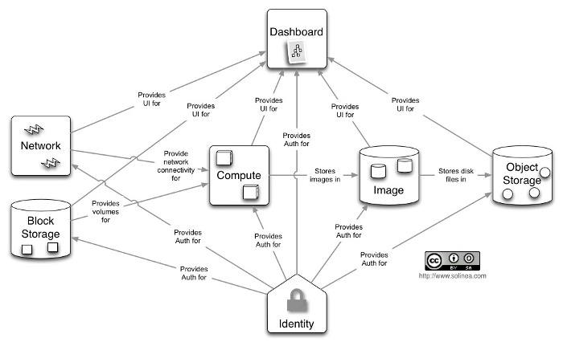
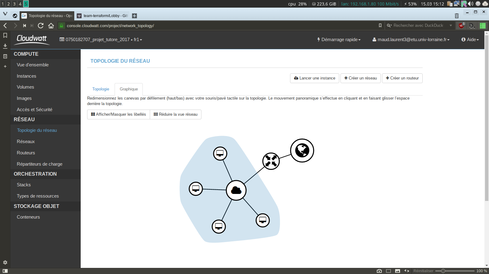

Explication de:
- infrastructure as code OK
- provider OK
- provisionner OK
- hébergeur (ovh/ cloudwatt)
- vps (instance) OK
- mouvance du devops OK
- proof of concept OK
- cluster 
- recette OK
- ip Flottante (principe etc etc) OK

Partie bénéfice terraform a quoi ca sert concretement  / infrastructure as code
Partie comparaison Avant Térraform / mtn avec Terraform

- Réponse au sujet initial (contexte / motivations / problématique,réalisations, etc.)
- Inventaire des tâches réalisées, des ressources produites
- Répartition du travail au sein du groupe
- Section Bibliographie (source image et texte Copié)

- intro sur mtn entreprise besoin infra as code / dev ops / cloud computing  ... (donc amene utilité Terraforml ss entendu) OK
- python-nova OK

[TOC]

# Introduction
## Le cloud computing

Le Cloud computing est un concept qui s'oppose à la notion de stockage local. Pour faire simple, le cloud computing va permettre d'utiliser des ressources informatiques sans les posséder réellement, de fournir des services ou des applications accessibles partout depuis internet. Il y a de nombreux avantages à utiliser un cloud computing. Tout d'abord, l'utilisateur n'a pas d'infrastructure à gérer, ce qui est parfois plus simple pour des entreprises, car c'est le fournisseur cloud qui s'occupe de la maintenance de ses équipements. Il permet donc une réduction des coûts en n'ayant pas besoin d'investir dans une infrastructure interne, mais en payant uniquement ce qu'il consomme à son fournisseur de cloud. Cependant, on a bien entendu des inconvénients comme le fait de savoir où le prestataire de service stocke nos données (territoire national ou pas -> problèmes de loi), la sécurité du cloud sur le stockage, la confidentialité et aussi vis-à-vis des hackers, on doit donc avoir confiance en le prestataire.

Il existe trois catégories de services pour le cloud computing.

- Le cloud privé : infrastructure pouvant être gérée en interne par l'entreprise ou par un prestataire qui se verra confier les tâches relatives à l'administration et l'optimisation des performances. Il est conçu uniquement pour un seul utilisateur pour répondre aux mieux aux besoins. Ce modèle a pour avantage de laisser à l'entreprise le contrôle à la fois sur la gestion des services, des données et de l'infrastructure. Le fait que ce soit un système fermé permet de mieux connaître les paramètres de sécurité, les garanties de service et la politique de confidentialité. Cependant, le déploiement de ce type d'infrastructure est très coûteux à mettre en place.

- Le cloud public : structure souple et ouverte proposée par des tiers spécialisés comme Amazon Web Services, Microsoft Azure, IBM, Google Compute Engine ou encore Cloudwatt. Le plus souvent ces services sont vendus sur demande, le client va donc être facturé sur ce qu'il consomme. L'ensemble de l'infrastructure est géré par le fournisseur de service, ce qui permet une utilisation plus souple pour le client. Le cloud public s'adapte rapidement aux différents besoins, c'est ce qui charme le plus les entreprises (ne pas être limités par le volume de données). L'un des inconvénients est l'absence de contrôle sur cette solution, que ce soit sur les données, sur la rapidité (beaucoup d'utilisateurs serveur mutualisé) pas forcément adapté à nos besoins. Si l'entreprise recherche de la confidentialité, le service de cloud public n'est pas recommandé. Pour l'aspect économique, ce service va permettre une réelle économie, car il n'y a pas de matériel ou d'informaticien à gérer, mais plus le client utilisera le service plus la facture sera élevée.

- le cloud hybride : est un système mixte qui mélange le cloud privé et public. Le client va faire appel à plusieurs clouds indépendants les uns des autres, ce qui permet de placer les données sensibles et confidentielles dans un cloud privé et les autres dans un cloud public. Avec ce type de cloud, on va aussi pouvoir réduire les coûts d'exploitation en tirant l'avantage des deux infrastructures, on va ainsi dimensionner son cloud privé pour une charge moyenne et le cloud public pour répondre aux montées de charge.

(TODO : encore du C/c)
Les différents modèles de cloud englobent plusieurs types de services, que l’on peut regrouper en trois parties :
- IaaS - Infrastructure As a Service : le but est d’offrir un service de bas niveau, le consommateur peut alors choisir le système d’exploitation et y installer les outils adaptés à ses besoins. Il est possible de louer dynamiquement des machines virtuelles pour une courte durée. Il est également possible de louer un ensemble de machines constituant une infrastructure externe. Les acteurs français du IaaS sont Online.net, OVH (Kimsufi), ...
- PaaS - Platform As a Service : cette fois-ci, le système est déjà installé, c’est le fournisseur qui gère le système et l’infrastructure. Le consommateur profite alors de la plate-forme pour y installer les applications souhaitées. Un exemple illustrant bien le PaaS est l’hébergement web, où l’hébergeur fournit une plate-forme souvent LAMP4, afin d’y héberger des sites web ou des systèmes de gestion de contenus.
- SaaS - Software As a Service : c’est une suite d’applications proposées aux consommateurs. Ces derniers ne s’occupent de rien, c’est le fournisseur qui gère l’intégralité de l’infrastructure, des systèmes et des logiciels. Gmail, Office Web Apps, Google Apps sont les fournisseurs de SaaS les plus connus.

## Contexte du projet

Xilopix (NOTE : url du site) est une start-up basée à Epinal qui développe un moteur de recherche pensée pour le tactile. Leur technologie se diffère des autres navigateurs web, car lors d'une recherche on va avoir une combinaison d'éléments de différentes natures (textes, images, vidéos, pages web, géolocalisation, sons, etc.) qui sera possible d'affiner en choisissant à quel info on souhaite avoir accès. De fait Xilopix va permettre d'améliorer la pertinence des résultats de recherche tout en offrant une nouvelle expérience utilisateur à la fois visuelle, tactile et ludique.
Xilopix utilise une infrastructure cloud avec plusieurs hébergeurs (ovh et cloudwatt) tous sur OpenStack. OpenStack permet de faire du IaaS (le consommateur peut choisir pour ses machines le système d'exploitation et les différents outils dont il a besoin), il va monter une infrastructure dans le domaine du cloud computing. Cependant, Xilopix souhaiterait ne plus être dépendant d'OpenStack et être libre d'utiliser AWS par exemple. C'est dans cette optique qu'intervient Terraform.

## Enjeu et problématique

L'objectif du projet est de développer un proof of concept sur l'outil Terraform pour pouvoir démontrer les avantages de cet outil.

> Un proof of concept est une réalisation expérimentale concrète et préliminaire, courte ou incomplète, illustrant une certaine méthode ou idée afin d'en démontrer la faisabilité. (NOTE source wikipédia: https://fr.wikipedia.org/wiki/Preuve_de_concept)

Pour se faire, nous allons mettre en place un cluster de quatres machines virtuelles ainsi qu'un réseau, un sous-réseau et un routeur pour recréer une infrastructure minimale fonctionnelle avec l'outil Terraform. Xilopix ayant une infrastructure utilisant OpenStack, nous avons créer des configurations fonctionnant pour OpenStack.

A partir de ces études, Xilopix pourra choisir d'utiliser ou non cet outil.

La finalité du projet est d'obtenir une création rapide et demandant un minimum d'intervention humaine pour déployer plusieurs machines aussi bien sous OpenStack, sous AWS ou tout autre provider. Terraform va donc nous permettre de réduire les dépendances entre ces outils et les infrastructures qui les utilisent tout en facilitant la mise en place de machines.

## Quelques mots sur Openstack

OpenStack est un ensemble de logiciels/modules open source permettant de déployer des infrastructures de cloud computing. La technologie possède une architecture modulaire composée de plusieurs projets (Nova, Swift, Glance…) qui permettent de contrôler les différentes ressources des machines virtuelles telles que la puissance de calcul, le stockage ou encore le réseau inhérents au centre de données sollicité.

## Quelques mots sur Terraform

Terraform est une solution pour la construction, la modification et le versionning d'infrastructure de manière sûre et efficace. Développé depuis 2013 par HashiCorp, c'est un outil en pleine expansion. Il permet de gérer plusieurs fournisseurs de services existant ainsi que des solutions développées en interne. Avec cette technologie, il est possible d'administrer des composants de bas niveau comme les IaaS, le stockage et la mise à niveau, ainsi que des composants haut niveau comme les entrées DNS et les fonctionnalités SaaS.

# Openstack / python-nova 

Xilopix fonctionne avec Openstack, nous avons donc du apprendre rapidement son fonctionnement pour pouvoir ensuite travailler plainement sur sa mise en place avec Terraform.

## Introduction

Openstack est un projet qui est né en 2010 (licence Apache 2.0) par l'entreprise RackSpace. OpenStack est un logiciel libre qui va nous permettre de faire du cloud computing et qui permet de faire du IaaS pour du cloud privé ou public. Le but d'Openstack est d'offrir à son utilisateur une multitude de module qui va lui permettre de faire de l'infrastructure as a service c'est à dire deployer des machines virtuelles en optimisant les ressources materielles. On peut les deployer dynamiquement pour une courte durée, mais il est également possible de deployer un ensemble de machines constituant une infrastructure externe.

## Les modules : services d'OpenStack.

Openstack se compose de plusieurs modules pour fonctionner, avec des modules plus ou moins important pour la création d'infrastructure.

### Keystone, le service d'identité

Fournit un service d’authentification et d’autorisation pour les autres services d’OpenStack. Fournit un catalogue de endpoints pour tous les services d’OpenStack.

### Glance, la gestion d'images

Stocke et récupère des images disques de machines virtuelles. OpenStack Compute les utilise lors du provisioning d’instance.

### Nova, le Compute

Nova est le coeur du project Openstack, il gère le cycle de vie des instances dans un environnement OpenStack. Les tâches incluent la planification, la création et la mise hors service de machines virtuelles à la demande.

### Horizon, l'interface web

Fournit un portail libre-service de type web permettant d’interagir avec les services sous-jacents d’OpenStack, comme le lancement d’une instance, l’attribution d’adresses IP ou la configuration des contrôles d’accès.

### Cinder, le service de disques persistants

Fournit un stockage bloc persistant aux instances en cours d’exécution. Son architecture basée sur des drivers de type plugin facilite la création et la gestion des devices de stockage bloc.

### Neutron, la gestion de réseaux

Permet le Network-Connectivity-as-a-Service pour d’autres services d’OpenStack, comme Compute. Il fournit une API utilisateur pour définir les réseaux et les attachements à ces réseaux. Il possède une architecture modulaire qui permet le support de la plupart des fournisseurs et des technologies réseau.

### Swift, le stockage d'objet

Stocke et récupère des objets de données non structurées via une API RESTful basée sur HTTP. Le service est hautement tolérant aux pannes avec sa réplication de données et son architecture de type scale-out. Son implémentation diffère des serveurs de fichiers à répertoires montables. Le service écrit les objets et les fichiers vers plusieurs disques, en s’assurant que les données sont répliquées sur un cluster de serveurs.

### Heat, le service d'orchestration

Orchestre de nombreuses applications de cloud composites en utilisant soit le format de template natif HOT ou le format CloudFormation d’AWS, soit au travers d’une API REST native OpenStack, soit au travers d’une API compatible avec CloudFormation.

### Ceilometer, le service de métrologie

Surveille et mesure un cloud OpenStack dans un but de facturation, de mesure de performances, de scalabilité et de statistiques.

Voici un shema qui permet de montrer le lien entre tout les modules.

 

## Le Client Python nova 

Le client Python-nova est un client en ligne de commande pour le module Nova OpenStack , il va nous permmetre de mettre en oeuvre 100% de l'API Nova , et aussi la gestion des instances, des images, etc...

### Installation de python-nova

Pour installer le plugin python-nova, il faut avoir préalablement installé python et son système d’installation pip.
Pour lancer l’installation il suffit de taper pip install -U python-novaclient .
 
### Configuration des variables d’environnement pour Openstack

Pour configurer toutes les variables, Openstack génère un fichier RC contenant la totalité des variables d’environnement à configurer.

Depuis Cloudwatt il faut aller dans les paramètres *accès et sécurité* puis *accès API* et enfin télécharger le fichier. En effet Cloudwatt génère un fichier contenant toutes les variables d'environnement nécésaire à la configuration de la connexion Openstack.

L’éxécution du fichier se fait grâce à la commande `source 0750182707_projet_tutore_2017-openrc.sh` et permet la configuration automatique des variables.

### Liste des instances 
La liste des instances créées sont visibles à l’aide de la commande `nova list`.

## Création de l’instance
### Génération de la clef ssh

`ssh-keygen`

### Intégration clef ssh au keypair Openstack

`nova keypair-add --pub-key .ssh/id_rsa.pub SSHKEY`

### Choix du flavor

`nova flavor-list` affiche la liste des flavors disponibles. Une fois choisi, il faut récuperer son ID qui sera renseigné lors de la création de l’instance.

### Choix de l’image (système installé)

`nova image-list` affiche la liste des images systèmes disponibles. Une fois choisi,
Il faut récuperer son ID qui sera demandé lors de la génération de l’instance.

### Création de l’instance

`nova boot --key-name SSHKEY --flavor 16 --image 185e1975-c9c5-4358-909e-5e329808902e instance1`

Pour la création de l’instance on retrouve quatre éléments :
- le nom du keypair
- l’id du flavor
- l’id de l’image
- le nom de l’instance

 


# Terraform
## Présenation (Schéma de ou se place dans prod -dans meme style celui du book crack mais avec ansible en plus (voir xml de draw.io))

Terraform est un outil développé en Go qui permet la gestion d'infrastructure à l'aide de recettes. L'objectif de ce logiciel est de permettre une configuration centralisée, rapide et efficace d'une infrastructure.

Terraform fonctionne avec des fichiers texte pour configurer les futures infrastructures. Ces fichiers texte appelé \og recette \fg servent à décrire l'architecture des providers tel qu'Openstack ou AWS. La configuration se fait dans un fichier \og main.tf \fg qui est écrit en HCL(NOTE: HashiCorp Configuration Language). La configuration peut aussi être générée automatiquement par machine avec le format JSON(NOTE). L'extension du fichier sera alors \og main.tf.json \fg.

Un provider est un service pour le cloud computing, généralement un IaaS.

Terraform génère un plan d'exécution se basant sur les recettes et décrivant les étapes qu'il va effectuer. Puis exécute le plan précédemment défini pour mettre en place l'infrastructure. Terraform détecte les changements effectué dans les fichiers et créé des nouveaux plans d'exécution conformément à ses changements.

Terraform permet de gérer les composants de bas niveau comme les IaaS, le stockage et la mise à niveau, ainsi que des composants hauts niveaux comme les entrées DNS et les fonctionnalités SaaS.

## Caractéristiques

- ** Insfrastructure as code : ** L'infrastructure est décrite en utilisant une syntaxe de configuration de haut niveau (HCL). Cela permet à un data center d'être versionné et traité comme tout autre code.

- ** Plan d'exécution : ** Terraform a une étape de \og planification \fg qui génère un plan d'exécution. Le plan d'exécution montre les actions que Terraform effectuera lorsqu'il sera lancé. Cela permet d'augmenter la sécurité en évitant d'avoir des surprises lorsque Terraform manipule l'infrastructure.

- ** Graphique des ressources : ** Terraform construit un graphique de toutes les ressources des infrastructures, et parallélise la création et la modification de toutes ces ressources non-dépendantes. Grâce à cela, Terraform construit l'infrastructure aussi efficacement que possible, et les utilisateurs peuvent avoir un aperçu des dépendances de leur infrastructure.

- ** Automatisation des changements : ** Des ensembles complexes de changements peuvent être appliqués à une infrastructure avec une interaction humaine minimale. Pour se faire Terraform se base sur le plan d'exécution et le graphique de ressources mentionnés précédemment, évitant ainsi des erreurs humaines possibles.

## Quelques cas d'utilisations (selon la doc)

### Self-service Cluster

Dans de grandes organisations, il devient plus attrayant de créer une infrastructure \og self-service \fg, permettant aux équipes de gérer leur propre infrastructure à l'aide de l'outillage fourni par l'équipe centrale d'exploitation.

À l'aide de Terraform, la connaissance de la construction de l'infrastructure et de l'échelle d'un service peut être codifiée dans une configuration. La configuration de Terraform peut être partagée au sein d'une organisation permettant aux équipes d'utiliser Terraform comme un outil pour gérer leurs services sans connaître la configuration.

### Démos de logiciels

A l'instar de Vagrant qui permet la création d'environnement virtualisé, les éditeurs de logiciels peuvent fournir une configuration Terraform pour créer et démarrer une infrastructure de démonstration. Ceci permet aux utilisateurs finaux de mettre en place rapidement un environnement de test sur leur propre infrastructure.

### Multi Cloud-Déploiement

Il est souvent attrayant de répandre l'infrastructure sur plusieurs cloud pour augmenter la tolérance aux pannes. En utilisant une seule région ou un seul fournisseur cloud , la tolérance aux pannes est limitée par la disponibilité de ce fournisseur. Avoir un déploiement multi-cloud permet une meilleure récupération de la perte d'une région ou tout le fournisseur.

Terraform permet la configuration de plusieurs providers en une seule configuration. Cela simplifie la gestion et l'orchestration des providers, en aidant la création d'infrastructures multi-cloud.

## Syntaxe utilisé

Les configurations de Terraform sont écrites en HashiCorp Configuration Language (HCL). Ce langage se veut facile à écrire et à lire. L'écriture des configurations peut aussi se faire en JSON.

### Les bases du langage

*Commentaires*
	- # sur une seule ligne
	- /\* mon commentaires sur plusieurs lignes \*/

*Affectation des valeurs*

	key = value # la valeur peut être une chaîne, un nombre ou un booléen

*Chaînes multilignes* : On utilise `<< - EOF` et `EOF` pour créer des chaînes multilignes ce qui permet principalement d'intégrer des scripts dans la configuration.

Il existe également de nombreuses fonctions utilisables avec HCL comme par exemple la fonction format(format, args, ...) qui va permettre de formater une chaîne selon le format que l'on donne.

Les différents bloc se définissent avec des accolades dans le même principe que des fonctions dans les autres langages connu.
```language
ressource "nom_type_ressource" "nomRessource" {
	...
}
```

## Fonctionnement

Terraform étant développé en Go, il n'a pas besoin d'être installé. Il suffit de télécharger une archive .zip et de l'extraire. Il est ensuite possible d'utiliser les commandes associées à Terraform avec `./terraform ...`. Pour faciliter l'utilisation des commandes, il est recommandé de copier le fichier dans */usr/local/* et d'ajouter ensuite le chemin menant jusqu'au fichier en question dans le PATH `PATH=/usr/local/...:$PATH`.

Terraform peut être composé de plusieurs fichiers de configuration pour une infrastructure. Dans ce cas, les fichiers sont lus par ordre alphabétique, mais la priorité reste au fichier *main.tf*.


Les fichiers Terraform se composent de différents type de bloc : le bloc provider et le bloc ressource. Chacun de ses blocs peut se retrouver plusieurs fois dans un fichier.

### Bloc **`provider`**

C'est la partie configuration du provider avec principalement les accès pour la connexion à celui-ci. Terraform peut contenir plusieurs blocs provider. Ce bloc gère le cycle de vie des ressources (create, read, update, delete).
```language
provider "openstack" {
    user_name  = "admin"
    tenant_name = "admin"
    password  = "pwd"
    auth_url  = "http://myauthurl:5000/v2.0"
}
```

Cloudwatt offre la génération d'un fichier .sh avec la totalité des identifiants est accès pour Openstack. Pour la connection, nous avons pu ommettre le bloc provider, Terraform se charge de récuperer les variables environnementales correspondant aux paramètres dont il a besoin pour retrouver le provider.

### Bloc **`resource`**

Partie permettant la gestion des ressources (composants physiques et logiciels) qui existent dans l'infrastructure. Le nom d'une ressource se compose du nom du provider puis du nom de la ressource en un bloc et enfin un nom pour cette ressource terraform qui sera utilisé uniquement par terraform.
```language
resource "openstack_compute_instance_v2" "nomTerraform" {
}
```

### Variables

Les variables peuvent être enregistrées dans un fichier \og variables.tf \fg ou \og .tfvars \fg. Pour appliquer des variables enregistrées sous cette dernière extension, il faut lancer la commande suivante `terraform apply -var-file=truc.tfvars`. Les variable sont généralement utilisé dans les fichiers sous la forme suivante `${var.nomVar}`.

### Modules (on a pas vraiment exploré ca, on le met ?)

Terraform possède des modules autonome vis-à-vis des configurations Terraform. Ces modules peuvent être installés par Terraform. Un module peut être un morceau de code Terraform ayant une fonction qui sera ensuite appelé.
```language
module "Name" {
	source = "github.../dossier"
}
```
### Les commandes

- `terraform plan` -- génère un plan d'action de la configuration. Le plan inclu toutes les actions faites et montre les modifications que va effectuer Terraform.
- `terraform plan -destroy -out=destroy.tf` -- génère un plan d'action qui à pour objectif de détruire tous le projet défini pas les fichiers de configuration. Le résultat est enregistré dans un fichier pour ensuite être appliqué avec `terraform apply destroy.tf`.
- `terraform destroy` -- détruit les configurations terraform qui ont été lancées depuis la même machine (équivalent à la technique du dessus).
- `terraform apply` -- applique le plan
- `terraform graph` -- permet visualisation du plan
- `terraform show` -- montre les infra en place

## Configurations effectuées
### Keypair

Une des premières configurations effectuées fut l'ajout de clef ssh pour le projet. Cet ajout avait pour objectif de nous permettre de nous connecter en ssh avec les instances créées.
```language
resource "openstack_compute_keypair_v2" "my_keypair" {
  name = "my_keypair"
  public_key = "${var.keypair}"
}
```
Terraform prend en paramètre pour cette resource un nom et la clef publique à ajouter.
Cette clef ssh est requise lors de la création d'instance. En effet celles-ci prennent en paramètre une keypair - `key_pair = "${openstack_compute_keypair_v2.my_keypair.name}"` - pour permettre la connection ssh à l'instance en question. Cependant une seule keypair peut être intégrée dans la ressource *instance*. Pour avoir tous accès en ssh aux instances, nous nous sommes paratagé la clef privé créée spécialement pour le projet et n'ayant pas de passphrase pour permettre à ansible de se connecter ensuite.

### Instances

Les instances sont la plus grande partie de la configuration, elles correspondent aux réseaux privés virtuels (vps) qui vont être créées.
```language
resource "openstack_compute_instance_v2" "vps" {
  count = 3
  name = "vps-test-${(count.index)+1}"
  image_id = "185e1975-c9c5-4358-909e-5e329808902e"
  flavor_id = "16"
  key_pair = "${openstack_compute_keypair_v2.my_keypair.name}"
  security_groups = ["${openstack_compute_secgroup_v2.terraform.id}"]
  floating_ip = "${element(openstack_compute_floatingip_v2.terraform.*.address, count.index+1)}"

  network {
    name = "${openstack_networking_network_v2.network_1.name}"
    fixed_ip_v4 = "192.168.0.1${(count.index)+1}"
  }
}
```
Une instance peut être créée dans une configuration unique, mais il est aussi possible d'en générer plusieurs automatiquement avec une seule ressource associée grâce au paramètre `count`.
La création des insantances se fait donc en partant de zéro. Avec `count.index` nous pouvons récuperer l'index actuel de la boucle générée par tarraform. Chaque instance est ratachée à un ou plusieurs réseaus selon les besoins. Pour notre proof of concept, nous avons utilisé un seul réseau. Pour connecter les instances au réseau, il faut écrire un bloc *network* comme ci-dessus.

### Security group

Le security group permet d'autoriser les transmissions sur certain port. Un security group fonctionne sur le même principe qu'un firewall. Il est conposé de règles *rule*. Une règle est définit pour un port. Nous avons crés un security group nommé \og terraform \fg composé d'une seule règle permettant la connection ssh (port 22).
```language
resource "openstack_compute_secgroup_v2" "terraform" {
  name        = "terraform"
  description = "security group"
  rule {
    from_port   = 22
    to_port     = 22
    ip_protocol = "tcp"
    cidr        = "0.0.0.0/0"
  }
}
```

### Ip flotantes

Les ip flotantes permettent aux instances d'avoir une ip publique. Permettant ainsi de pouvoir accéder en ssh aux instances.
Terraform offre la posibilité de générer automatiquement les adresses ip en les piochant dans un pool public d'adresses. Cependant l'utiisation d'ansible requière la connaissance des adresses ip flottantes attribuée aux machines. Pour ce faire plusieurs solutions s'offraient à nous.
- La première est l'importation des adresses ip avec `terraform import`. Cependant Terraform ne permet pas la création de boucle, seule la variable *count* est utilisable. Le changement de nom de la ressource importée est impossible avec ce système de boucle. L'importation avec terraform fonctionne de la manière suivante : La ressource est importé avec la commande, mais pour être utilisable elle doit avoir une ressource créée dans le fichier .tf. L'importation d'une multitude d'adresses ip entrainaient la création du même nombre de ressources le tout créé à la main. La tâche devenaient vite fastidieuse.
- La seconde solution est la création d'une liste contenant les adresses ip floatantes créées depuis l'interface web de l'hébergeur. L'appel de l'adresse se fait depuis la ressource instance de terraform qui vas récuperer une adresse dans la liste.

```language
#Ip flotantes
variable "id_ip_flottante" {
    default = ["84.39.49.19","84.39.46.157","84.39.44.165","84.39.41.206"]
}

resource "openstack_compute_instance_v2" "vps" {
	floating_ip = "${var.id_ip_flottante[(count.index)+1]}"
}
```
Nous avons donc choisit cette dernière pour mettre en place le système d'ip flotantes dans notre infrastructure terraform.


### Réseau, sous-réseau et routeur

Terraform permettant de créer toute une infrastructure, nous nous sommes aussi penchés sur la création du réseau, de ses sous-réseaux et du routeur nous permettant un accès au monde extérieur.

#### Réseau et sous-réseau

Pour être utilisable, les instances doivent être connectées à un réseau. Terraform offre la possibilité de crée rapidement et facilement un réseau ainsi que les sous-réseaux et port utile à celui-ci. Les instances sont donc configurées pour être intégrées à ce réseau et obtenir une adresse ip dans ce dernier.
```language
resource "openstack_networking_network_v2" "network_1" {
  name = "resTerraform"
  admin_state_up = "true"
}

# Sous-réseau
resource "openstack_networking_subnet_v2" "subnet_2" {
  name = "SousRes_2"
  network_id = "${openstack_networking_network_v2.network_1.id}"
  cidr = "192.168.0.0/24"
  ip_version = 4 
}

#Port du sous-réseau
resource "openstack_networking_port_v2" "port_1" {
  name = "port_1"
  network_id = "${openstack_networking_network_v2.network_1.id}"
  admin_state_up = "true"
}
```

#### Routeur

Pour que l'infrastructure créée soit opérationelle, il faut lui autoriser un accès à l'extérieur du réseau. Pour se faire nous passons par un routeur qui est lui même composé d'une interface le relinant à un des réseau crée précedement.
```language
resource "openstack_networking_router_v2" "router_1" {
  name = "routerTerraform"
  admin_state_up = "true"
  external_gateway = "6ea98324-0f14-49f6-97c0-885d1b8dc517"
}
```



# Provisionnement 
Terraform permet aussi le provisionnement de ses instances avec différents provisionners comme chef, puppet ou encore ansible. Cependant Terraform n'offre un service que pour Chef mais permet d'éxécuter différentes commande automatiquement depuis la machine lancant `terraform apply` avec le provisionner `local_exec` ou depuis la machine générée avec Terraform grâce au provisionner `remote_exec`. Celui-ci se compléte avec le bloc `connection` effectuant une connexion ssh avec les identifiants désiré. Ces dernières se mettant dans les instances.
Les ressources de type `null-ressource` permettent d'executer des commandes après la création des certaines ressources. Grâce à cela, il est possible de lancer ansible automatiquement à la fin de la création des vps.

# Ansible
## Présentation
## Utilisation, Fonctionnement, syntaxe
## Intégration à Terraform
## Configuration effectuée (pk on l'a fait, surtout expliqué pour les clef ssh)

# Répartition des tâches au seins du groupe
Le projet se tenait sur une seule technologie qui est Terraform. La répartition des tâches c'est donc faite par rapport aux différentes parties que nous avons du créer pour faire fonctionner notre infrastructure.
(TODO: Diagramme de GANTT ? ou truc semblable ?)

# Avant TerraForm 
## AWS CloudFormation 

CloudFormation fournit par Amazon Web Service permet de créer et de gérer un ensemble de ressources qui sont liées, de les ordonner, les mettre en service et les actualiser en mode ordonnée. Il permait d'avoir aussi une infrastructure as code avec des simples fichiers textes au format JSON ou YAML. Il fonctionne uniquement avec AWS mais le fonctionnement resemble à Terraform. Il permet de créer un modèle qui décrit toutes les ressources AWS que l'on veut (telles que des instances Amazon EC2 ou des instances de base de données Amazon RDS). De plus AWS CloudFormation s'occupe de leur mise en service et de leur configuration.
AWS CloudFormation a des modéles d'exemples déjà crée qui peuvent etre utilisés. Il est aussi possible de créer des modèles personalisés. 

## Heat 

Heat est un module de la partie orchestraction de OpenStack. La mission du programme OpenStack Orchestration est de créer un service accessible pour gérer l'ensemble du cycle de vie des infrastructures et des applications dans le cloud OpenStack. Heat fournit une orchestration à base de modèle pour décrire une application cloud. En s'exécutant OpenStack appels différentes API pour générer l'exécution d'applications cloud. Un template Heat décrit l'infrastructure pour une application cloud dans des fichiers textes qui sont lisibles et modifiables par les humains, et peut être géré par des outils de contrôle de version. Le logiciel intègre d'autres composants d'OpenStack. Les modèles permettent la création de la plupart des types de ressources OpenStack tels que les instances, ip flottantes, des volumes, des groupes de sécurité, les utilisateurs, etc. Ainsi que certaines fonctionnalités plus avancées telles que la haute disponibilité. Heat gère principalement l'infrastructure, mais les templates intègrent aussi des outils de gestion de configuration logiciel tels que Puppet et Ansible.


# TerraForm vs les autres logiciels

Les outils comme CloudFormation, Heat, etc... permettent à une infrastructure d'être codifiés dans un fichier de configuration. Les fichiers de configuration permettent à l'infrastructure d'être élastiquement créé, modifiée et détruite. Terraform est inspiré par les problèmes qu'ils résolvent.

Terraform utilise de la même façon des fichiers de configuration pour détailler la configuration de l'infrastructure, mais il va plus loin par le diagnostique ainsi que la permission de fournisseurs multiples et des services combiné et composé. Par exemple, Terraform peut être utilisé pour orchestrer un AWS et un groupe OpenStack simultanément, en permettant des fournisseurs du 3ème parti comme CloudFlare et DNSIMPLE d'être intégré pour fournir des services de DNS et CDN. Ceci permet à Terraform de représenter et gérer l'infrastructure entière avec ses services de soutien. Au lieu de seulement le sous-ensemble qui existe dans un fournisseur seul. Il fournit une syntaxe unifiée, au lieu d'exiger que des opérateurs utilisent des outils indépendants et non-interopérables pour chaque plate-forme et service.

Terraform sépare également la phase de planification de la phase d'exécution, en utilisant le concept d'un plan d'exécution. En exécutant terraform plan, l'état actuel est actualisé et la configuration est consulté pour générer un plan d'action. Le plan comprend toutes les actions à entreprendre. Quelles ressources seront créés, détruites ou modifiées ? Terraform génère un plan d'exécution décrivant ce qu'il va faire pour atteindre l'état désiré. En utilisant terraform graph, le plan peut être visualisé pour montrer les commandes qui vont être executées par celui-ci . Une fois que le plan est capturé, la phase d'exécution peut être limitée aux seules actions du plan. D'autres outils combinent les phases de planification et d'exécution, ce qui signifie que terraform montre les effets de changement qui va se produire sur l'infrastructure, qui devient rapidement insoluble dans les grandes infrastructures. Terraform permet aux opérateurs d'appliquer des changements avec confiance, car ils savent exactement ce qui se passera au préalable.

# Conclusion

TerraForm est un outils formidable permmetant de deployer des infrastructures de maniere simple et efficace. Il fournit une syntaxe simple et unifiée permettant de gérer presque toutes les ressources sans apprendre de nouveaux outils. En outre, Terraform est un outil open source. En plus de HashiCorp, la communauté autour de Terraform contribue à étendre ses fonctionnalités, corriger les bugs et documenter de nouveaux cas d'utilisation. Terraform aide à résoudre un problème qui existe dans chaque organisation et fournit un standard qui peut être adoptée pour éviter de réinventer la roue entre et au sein des organisations.
